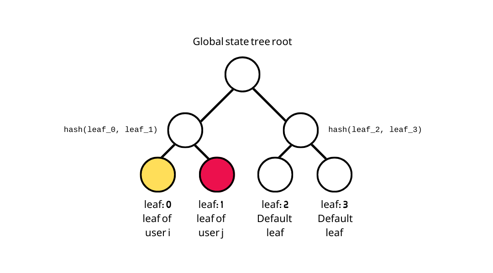

# Trees

## **State tree**

* A state tree stores the updated user state after a user signs up and a user performs the [user state transition](user-state-transition.md).
* It is an **incremental merkle tree** with it's leaves storing users' `identityNullifier`s and starting reputation, e.g.
  * a state tree leaf: `hash(`<mark style="color:green;">`identityNullifier`</mark>`,`` `<mark style="color:red;">`userStateTreeRoot`</mark>`)`
  * The default leaf is `0`


**NOTE:** this is an incremental merkle tree so leaves are inserted from left (leaf index 0) to right, one by one, instead of inserted directly into the specified leaf index.

**NOTE:** since state tree leaf is the hash of `identityNullifier` and other values, observers will be not be able to tell which user has inserted leaves into the tree.


## **Epoch tree**

* An epoch tree is used to **track the reputation received by epoch keys**. Non-repudiability is enforced at the circuit and smart contract level.

* An epoch tree is a **sparse merkle tree** with it's leaves storing the hash of reputation received by the epoch key, e.g.,
  * leaf index: epoch key
  * leaf value: `H(posRep, negRep, graffiti, timestamp)`

.png>)


See: [Reputation](reputation.md)

