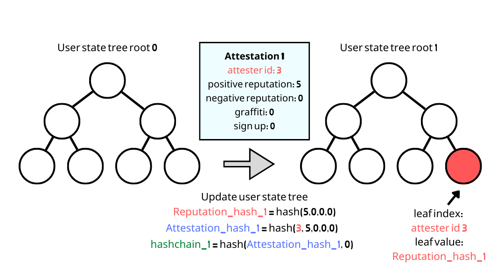

# User State Transition

### Why users have to perform user state transition?

User state transition is used to&#x20;

* Make sure users process their attestations correctly including the bad reputation.
* Generate a new state tree leaf in a new epoch to prove their latest reputation.

After user performs user state transition, he can&#x20;

1. Prove the latest reputation status.
2. Generate new epoch key proofs to receive attestations in the latest epoch.

### Workflow of a user state transition

#### 1. User computes epoch key of the latest transition (or sign up) epoch

#### 2. Check the state tree leaf

The pre-image of the state tree leaf is checked to determine the users starting reputation.

#### 3. Iterate over epoch keys

The pre-image of the epoch key leaves controlled by the user are verified. During this the `posRep` and `negRep` is summed and the `graffiti` is combined by taking the graffiti with the latest `timestamp`.

The summed rep values are added to the values proved from the state tree leaf.

.png>)

#### 4. Compute a new state tree leaf

A new state tree leaf is computed using the summed `posRep`, `negRep`, 'graffiti', and `timestamp values`. See the [State Tree](trees.md) documentation for the full state tree structure.

#### 5. Call unirep smart contract to insert a new state tree leaf

User performs user state transition by calling [`userStateTransition()`](https://github.com/Unirep/Unirep/blob/f3502e1a551f63ab44b73444b60ead8731d45167/packages/contracts/contracts/Unirep.sol#L559)``

* User will attach a [User State Transition Proof](../../circuits/user-state-transition-proof.md) when calling `userStateTransition`. This proof and public signals will be verified onchain.
* The new state tree leaf will be inserted into the state tree of the latest epoch.
* If a user does not do a state transition during a certain epoch they will not have a leaf in the state tree for that epoch.


See also

* [Trees](trees.md)
* [User State Transition Proof](../circuits/README.md)

